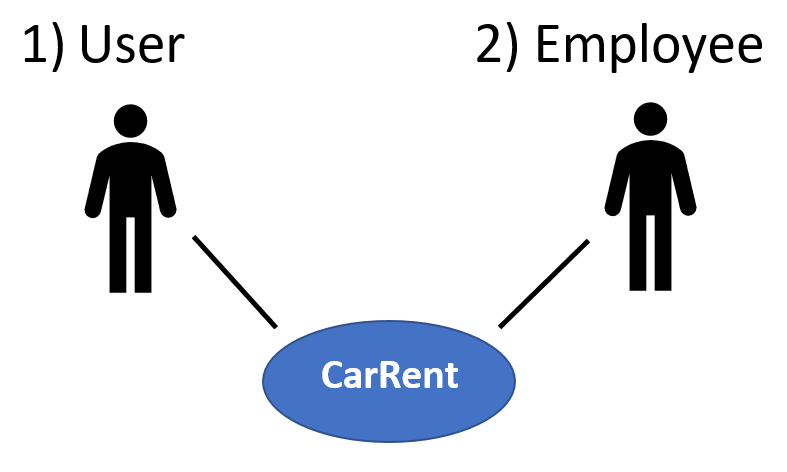
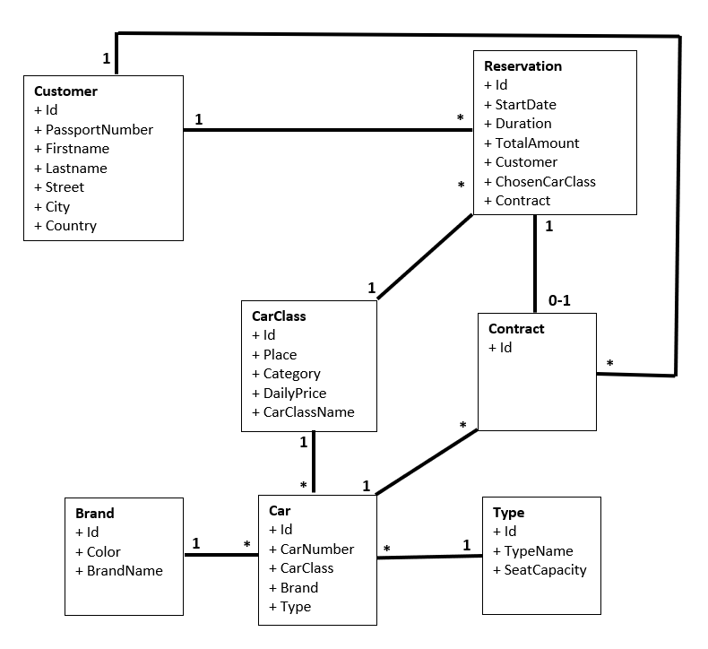
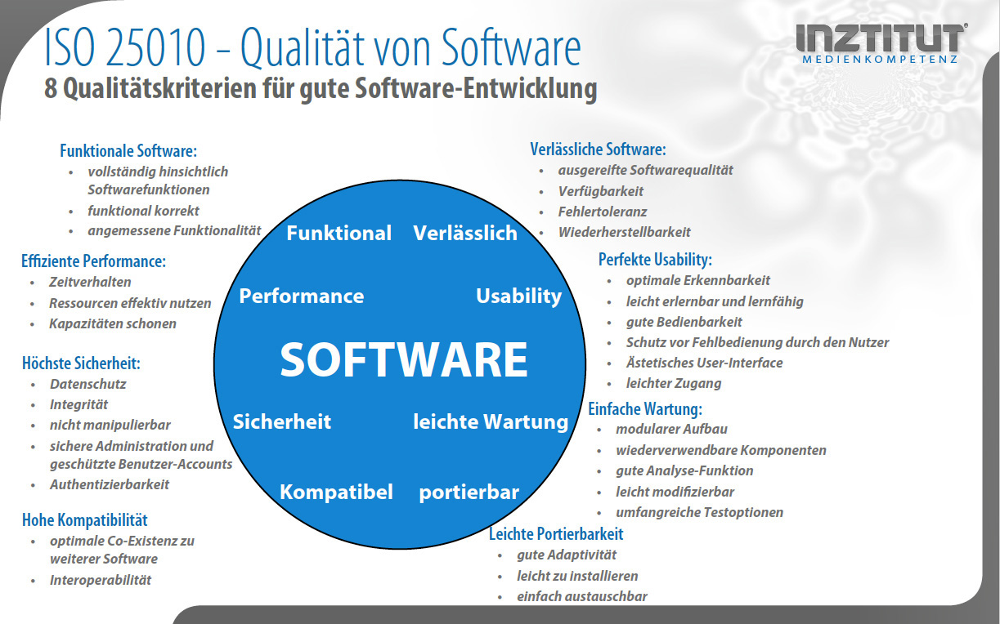

# CarRent
Das CarRent Projekt wurde von Markus Staub und Andy Steingruber erstellt und am 13.09.2022 online abgegeben.

## Big Picture
### Context

1. User
    - Reservationen erstellen
    - Autoklasse auswählen
    - Anzahl Tage der Reservation festlegen

2. Employee
    - Kunde verwalten (erfassen, bearbeiten, löschen, suchen)
        - Name, Adresse, Kundennummer
    - Autos verwalten und suchen (erfassen, bearbeiten, löschen, suchen)

- Was soll gebaut werden?
    - Es geht darum, ein neues Auto vermietungssystem «Carrent» zu erstellen.

- Wer benutzt das System?
    - Benutzer, Administratoren, Personal, Autovermieter uvm.

- Wie passt es in die bestehende IT-Landschaft?
    - Es soll so entwickelt werden, damit es problemlos in die bestehende IT-Infrastruktur hinein implementiert werden kann.

### Containers
- Was sind die technologischen Entscheide?
    - Das System sollte möglichst elastisch und zuverlässig sein. Damit ist gemeint, dass es in der Lage sein sollte, die Kapazität automatisch anzupassen. Zudem sollte es auch bei Störungen nicht direkt versagen.

- Wie kommunizieren die Container untereinander?
    - Damit die Container miteinander Kommunizieren können, werden sie über ein Containernetzwerk miteinander verbunden. \

- Als Entwickler möchte ich gerne wissen, wo ich Code schreiben muss?\
    - Die Struktur ist so gewählt, dass die verschiedenen SW-Entwickler unabhängig voneinander den Code bearbeiten können.

### Components
- Aus welchen Komponenten und Services besteht das System?
    - Es wird folgendes benötigt, eine Front-End-Plattform, eine Back-End-Plattform als Server oder Speicher. Zudem noch Cloud-basierte Programme und ein Netzwerk, damit man überhaupt darauf zugreifen kann. Z.B. Internet, Intranet oder Inter-Cloud.
- Ist klar wie das System «high-level» arbeiten soll?
    - Es sollte mit möglichst neuen Normen aufgebaut werden um somit eine aktuelle Struktur zu bilden. Somit ist alles weitestgehend vereinheitlicht und harmonisiert.
- Haben alle Komponenten ein Zuhause Container?
    - Soweit wir es verstanden haben, ja.

### Class
- Was sind die wichtigen Konzepte des Systems?
    - Wichtig ist, dass alles soweit getrennt ist, damit es eindeutig und einfacher ist, etwas anzupassen.
- Wie stehen die Konzepte zu einander?
    - Die Konzepte stehen direkt zueinander, um möglichst wenig konflikte zu haben.

## Domain Model

## Use Cases
### Kunden Automiete
- Actors: Kunde
- Beschreibung: Ein Kunde möchte ein Auto mieten und wählt den Autotyp aus, welcher er möchte. Danach wird er automatisch zu dem Zahlterminal weitergeleitet, damit er bezahlen kann.

### Spezifische Auto auswahl
- Actors: Vermittler, System
- Beschreibung: Ein Kunde wählt ein Typ Auto aus und das System Teilt ein spezifisches Auto dem Kunden hinzu. Danach wird es von dem Vermittler geprüft und bei Problemen dann Manuel eingepflegt.

## Qualitätskriterien für gute SW

## Teststrategie
- Wir haben uns für die "top-down" Teststrategie entschieden. Da wird zuerst die Hauptfunktion getestet, die Detailfunktionenn werden zuerst ignoriert oder mittels "Stubs" simuliert.

## Metrikdefinition
- Die Anzahl der Codezeilen.
- Die Halstead-Metrik zur Implementierungsabschätzung in der Entwurfsphase.
- Die Pfadüberdeckungskennzahl.